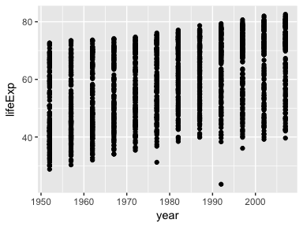
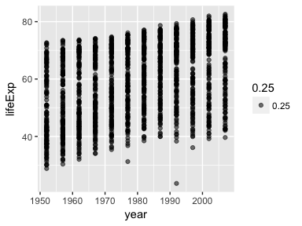
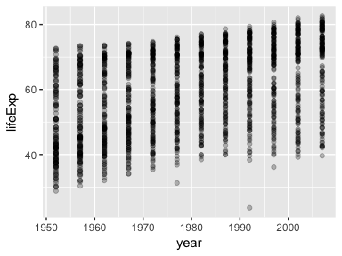
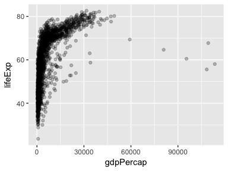
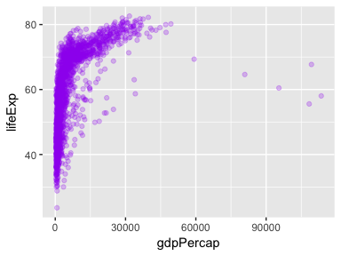
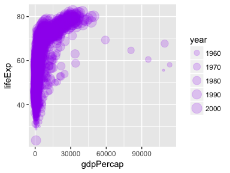
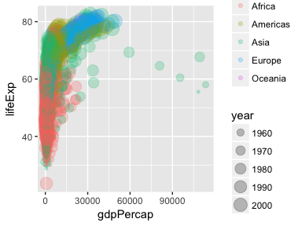
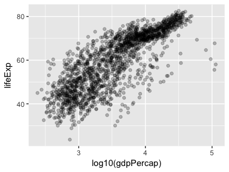
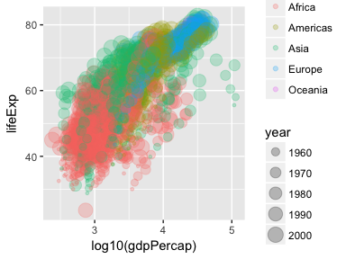

cm006 Notes and Exercises: Intro to ggplot2
================
2017-09-21

``` r
suppressPackageStartupMessages(library(tidyverse))  # The tidyverse contains ggplot2!
suppressPackageStartupMessages(library(gapminder))
knitr::opts_chunk$set(fig.width=4, fig.height=3)
```

Plotting in R
-------------

There are three main ways you can produce graphics in R. In order of inception, they are

-   base R
-   `lattice` (an R package)
-   `ggplot2` (an R package)

Base R is tedious and unwieldly. Lattice is a nice option, but I find it requires setting up a plot to then just override everything.

`ggplot2` is a very powerful plotting system that...

-   creates graphics by adding layers.
-   is based off of the [grammar of graphics](http://www.springer.com/gp/book/9780387245447) (book by Leland Wilkinson) -- hence "gg".
-   comes with the `tidyverse` meta-package.
-   has a steep learning curve, but pays dividends.

Stackoverflow was my main source of learning. Google what you're trying to do, and persevere. You can do it.

`ggplot2` framework
-------------------

First, there are two ways you can make a plot wth `ggplot2`.

1.  The `qplot` function: limited functionality. "quick plot"
    -   We won't be focussing on this. No training wheels!

2.  The `ggplot` function: full functionality.

Let's go through the basic syntax using the `gapminder` dataset.

#### 1. Basic scatterplot

Let's try to make a basic scatterplot of `year` vs. `lifeExp`.

Quick ways: - `plot(gapminder$year, gapminder$lifeExp)` -- base R - `qplot(year, lifeExp, data=gapminder)` -- `ggplot2`'s "quick plot".

Let's just see the syntax right off the bat.

``` r
ggplot(gapminder, aes(x=year, y=lifeExp)) +
    geom_point()
```



The first line initiates the plot. The second one *adds a layer* of points.

Let's see the components of each of these.

Two of the most important aspects of a ggplot are the **geometric objects** and the **scales** (part of the grammar of graphics).

-   **geometric objects** are things that you can draw to represent data.
    -   Examples: points, lines, polygons, bars, boxplots, histograms
    -   Indicated as new layers with `geom_*` where `*` is `point`, `line`, ...
-   **scales** are aspects of a geometric object that correspond to a numeric scale.
    -   Examples:
        -   horizontal (x) position can indicate one variable.
        -   vertical (y) position can indicate another variable.
        -   size of a point
        -   shape of a point
        -   transparency
    -   **aesthetic mappings** link variables to scales through the function `aes`.

Every geometric object has *required* and *optional* aesthetic mappings. Check the documentation of the `geom_` to see what's required (in bold). Examples: - *points* require a horizontal (x) and vertical (y) position. - line *segments* require starting and ending x and y

Let's revisit the above plot. The first line outputs an empty plot because there are no `geom`'s (geometric objects):

``` r
p <- ggplot(gapminder, aes(x=year, y=lifeExp))
p + geom_point() #adds points to plot
```


``` r
p + geom_point(alpha = 0.25) #makes points more transparent
```


``` r
p + geom_point(aes(alpha = 0.25)) #aesthetics here or in beginning
```



``` r
ggplot(gapminder) +
  geom_point(aes(x=year, y=lifeExp), alpha = 0.25) #diff way
```


(Yes, we can assign ggplots to variables in R)

Contains: 1. the data frame, `gapminder`, and 2. an indication of which variables in the data frame go with which scale.

Next, we can add a *layer* with the `+` symbol. We add the "point" geometry to "execute" the setup and display points, to obtain the original plot.

This plot would benefit with some *alpha transparency* -- another type of scale. Let's put in 25% transparency:

``` r
p + geom_point(alpha=0.25)
```



Notes: - This scale is *outside of an aesthetic mapping*, meaning that ggplot will not associate it with a variable. - Scales can be indicated in the `geom` call. Scales within `aes` that appear in the `ggplot` function apply "globally" to the plot.

**Exercises**:

1.  Make a scatterplot of `gdpPercap` vs `lifeExp`. Store it in a variable called `p2`.

``` r
p2 <- ggplot(gapminder, aes(x=gdpPercap, y=lifeExp))
p2 + geom_point(alpha=0.25) #got the easy question.
```



1.  To `p2`, make the size of the points indicate the `year`, choose a level of alpha transparency that you're happy with, and make the points your favourite colour.

``` r
p2 + geom_point(alpha=0.25, col = "purple")
```



``` r
#no idea how to make size of points indicate year...
#skipping to next question for now...
p2 + geom_point(aes(size=year), alpha=0.2, col = "purple")
```



``` r
#right answer, don't put alpha or color within aesthetic function
```

1.  To `p2`, colour the points by `continent`. but this time with year being represented by the size of the points.

``` r
#no idea again.
p2 + geom_point(aes(size=year, col=continent), alpha=0.25)
```



``` r
#managed to figure it out!
```

1.  To `p2`, add another layer called `scale_x_log10()`. Make a second plot by redoing the plot in (1), but replacing `gdpPercap` with `log10(gdpPercap)`. What do you notice?

``` r
#too far behind to complete this question.
p3 <- p2 + geom_point(aes(size=year, col=continent), alpha=0.25)
p3 + scale_x_log10() #kinda figured out first part of question
```


``` r
library(gapminder) #had to re-load since resuming class demo!
library(tidyverse) #also needed for ggplot
#can also go to top of document and run first code chunk

p4 <- ggplot(gapminder, aes(x=log10(gdpPercap), y=lifeExp))
p4 + geom_point(alpha=0.25)
```



``` r
p4 + geom_point(aes(size=year, col=continent), alpha=0.25)
```



``` r
#got it, it looks the same as before now! but done more simply.
#NOTE THIS IS HOW YOU GET DIFF COLOR AND SIZES!*****
#apparently adding sizes is as easy to do as adding color!

#can also use scale_x_log10(gdpPercap) as a diff way to do it
```

Continuation of `ggplot2`
-------------------------

Now that we've got the basics down pat, let's expand our flexibility by going through [Jenny's scatterplot tutorial](https://github.com/jennybc/ggplot2-tutorial/blob/master/gapminder-ggplot2-scatterplot.md).

### Regression curve

**Exercise 5**: Make a plot of `year` (x) vs `lifeExp` (y), with points coloured by continent. Then, fit a regression line to each continent, without the error bars. If you can, try piping the data frame into the `ggplot` function.

### Facetting

**Exercise 6**: Make a plot of `year` (x) vs `lifeExp` (y), facetted by continent. Then, fit a smoother through the data for each continent, without the error bars. Choose a span that you feel is appropriate.

### `geom_line`

The key here is to remember to indicate the variable to group by with `group=variable`.

**Exercise 7**: Plot the population over time (year) using lines, so that each country has its own line. Add alpha transparency to your liking.

**Exercise 8**: Add points to the plot in Exercise 7.
