cm007 Notes and Exercises: ggplot2, Round 2
================
2017-09-26

``` r
suppressPackageStartupMessages(library(tidyverse))  # The tidyverse contains ggplot2!
suppressPackageStartupMessages(library(gapminder))
knitr::opts_chunk$set(fig.width=4, fig.height=3)
```

Continuation of Scatterplots
----------------------------

### Regression curve

-   Crash course on regression
    -   Regression analysis fits some curve through the data, representing the mean of Y given the specified X value.
    -   Sometimes we assume it's a line, and take this "mean curve" to be the line of best fit.
    -   Sometimes we fit a generic curve by averaging "nearby" points.

To add a regression line/curve, add a layer `geom_smooth` to your plot. Probably two of the most useful arguments to `geom_smooth` are:

-   `method=`...
    -   ...`"lm"` for a straight line. Stands for "Linear Model".
    -   ...other for a generic curve (called a smoother; default, hence the "smooth" part of `geom_smooth`).
-   `se=`... controls whether or not a confidence interval is plotted.

Examples:

``` r
vc1 <- ggplot(gapminder, aes(year, lifeExp)) +
    geom_point() 
vc1 + geom_smooth(se=FALSE)
```

    ## `geom_smooth()` using method = 'gam'

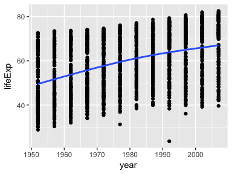

``` r
vc1 + geom_smooth(method="lm")
```

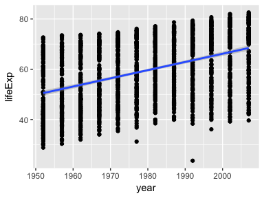

**Exercise 1**: Make a plot of `year` (x) vs `lifeExp` (y), with points coloured by continent. Then, to that same plot, fit a straight regression line to each continent, without the error bars. If you can, try piping the data frame into the `ggplot` function.

``` r
gapminder %>%
  group_by(continent) %>%
  ggplot(aes(x=year, y=lifeExp)) + #dont need to specify x&y here
  geom_point(aes(color=continent)) +
  geom_smooth(method="lm", se=FALSE)
```

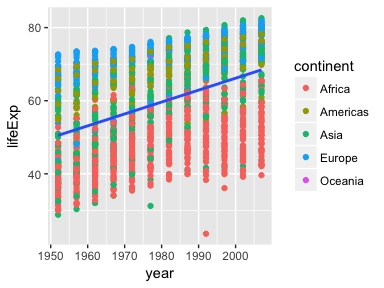

``` r
#couldnt quite get this one

ggplot(gapminder, aes(x=year, y=lifeExp, color=continent)) +
geom_point(aes(color=continent)) +
geom_smooth(method="lm", se=FALSE)
```


``` r
#adding color in main ggplot aes = color groupings for whole graph
```

**Exercise 2**: Repeat Exercise 1, but switch the *regression line* and *geom\_point* layers. How is this plot different from that of Exercise 1?

``` r
ggplot(gapminder, aes(x=year, y=lifeExp, color=continent)) +
geom_smooth(method="lm", se=FALSE) +
geom_point()
```

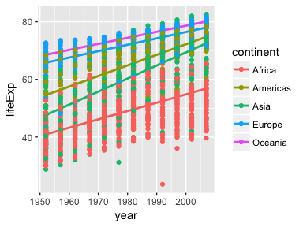

``` r
#order matters because points are on top of the lines here!
```

**Exercise 3**: Omit the `geom_point` layer from either of the above two plots (it doesn't matter which). Does the line still show up, even though the data aren't shown? Why or why not?

``` r
ggplot(gapminder, aes(x=year, y=lifeExp, color=continent)) +
geom_smooth(method="lm", se=FALSE) #ooh super fancy looking
```

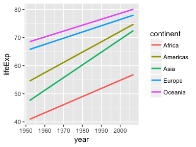

``` r
#ggplot doesn't need the raw data points to calculate regression!
```

### Facetting

We saw that we can **group** by using scales. For example, we can distinguish continents by using different shape or colour:

``` r
ggplot(gapminder, aes(gdpPercap, lifeExp)) +
    geom_point(aes(colour=continent))
```

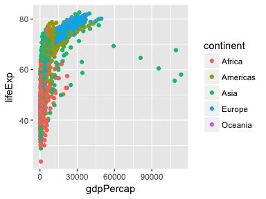

``` r
ggplot(gapminder, aes(gdpPercap, lifeExp)) +
    geom_point(aes(shape=continent))
```

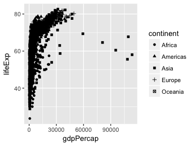

But these plots can get overloaded. In comes **facetting** to save the day! Let's add this to our list of concepts:

-   :white\_check\_mark: **geometric objects**, or `geom_`s.
-   :white\_check\_mark: **scales**, linked by...
-   :white\_check\_mark: **aesthetics**, through the `aes` function.
-   \*NEW\* **facetting**.

New idea covered here, may be relevant for me later!\* Actually, I kinda figured this out on my own but still good info!
========================================================================================================================

Facetting separates data from each group into its own "mini plot", called a *panel*. These panels are arranged next to each otherfor easier comparison. There are two facetting functions in `ggplot2`:

-   `facet_wrap`: 1D facetting -- we'll focus on this first.
-   `facet_grid`: 2D facetting \#means two variables!

`facet_wrap` puts the panels in "reading order", and goes to a new line if there's not enough room. Mandatory argument specification is `facet_wrap(~ VARIABLE)`. Example:

``` r
ggplot(gapminder, aes(gdpPercap, lifeExp)) +
    facet_wrap(~ continent) +
    geom_point()
```

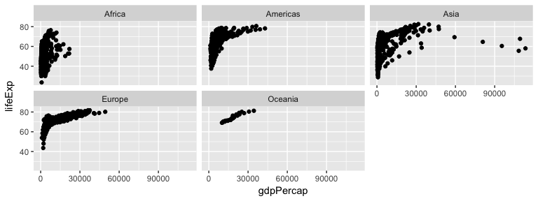

``` r
#facet important for comparing between plots!
```

As for other arguments of `facet_wrap` that I find to be most useful, check the documentation for `scales` and `ncol` -- and if you're brave, `labeller`.

Ncol = number of panels (i.e. 5 for continents)

Labeller = ? (Figure out later!)

**Exercise 4**: Make a plot of `year` (x) vs `lifeExp` (y), facetted by continent. Then, fit a smoother through the data for each continent, without the error bars. Choose a span that you feel is appropriate.

``` r
gapminder %>% #dataframe we're plotting
  filter(year<1995) %>% #a span that i feel appropriate?
  ggplot(aes(year, lifeExp)) + #make a plot
  geom_point() + #make a plot
  geom_smooth(method="lm", se=FALSE)+ #fit smoother, no error bars
  facet_wrap(~continent) #facet by continent
```

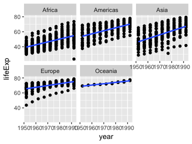

``` r
#my answer above, his answer below

ggplot(gapminder, aes(year, lifeExp))+
  facet_wrap(~continent) +
  geom_point() +
  geom_smooth(se=FALSE, span=0.9) #note, geom_smoothing using method = 'loess' (since we didn't specify)
```

    ## `geom_smooth()` using method = 'loess'

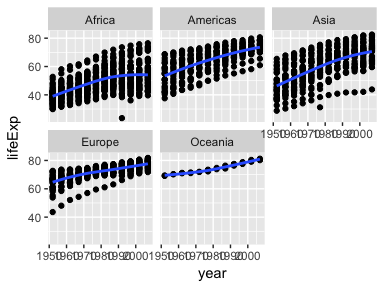

``` r
#span controls how wiggly your curve is! I misinterpreted question
```

`facet_grid` puts the panels in a grid. Each row corresponds to one grouping, and each column corresponds to another grouping. Mandatory argument specification: `facet_grid(GROUPING_VARIABLE_1 ~ GROUPING_VARIABLE_2)`.

Example: Let's also facet by "small" (&lt;=7,000,000 population) and "large" (&gt;7,000,000 population) countries. We'll need to add a "size" variable; we'll do that with `dplyr`, and pipe the result into the `ggplot` function:

``` r
vc2 <- gapminder %>% #above changes the size of figure when knit
    mutate(size=c("small", "large")[(pop>7000000) + 1]) %>% 
    ggplot(aes(gdpPercap, lifeExp)) +
    facet_grid(size ~ continent) 
vc2 + geom_point()
```

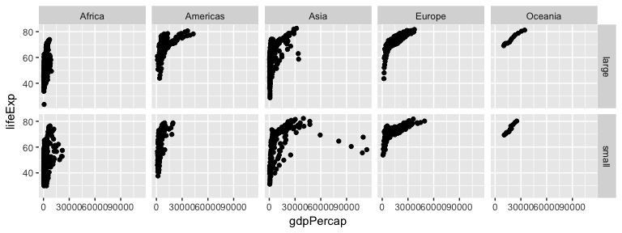

``` r
#oooooh this might be very helpful for my fishie plots!!!!! *****

#vc2 is used because we're manipulating dataframe with mutate fxn
```

Everything we've learned prior to this works in conjunction with facetting:

-   Colours:

``` r
vc2 + geom_point(aes(colour=year)) #fancy, using year as color!
```

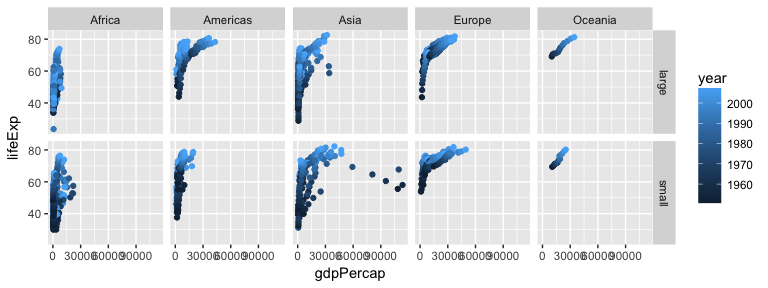

-   Regression curves and log scales:

``` r
vc2 + 
    geom_point(colour="brown",
               alpha=0.2) +
    geom_smooth() +
    scale_x_log10() #smooth curve rather than linear regression
```

    ## `geom_smooth()` using method = 'loess'

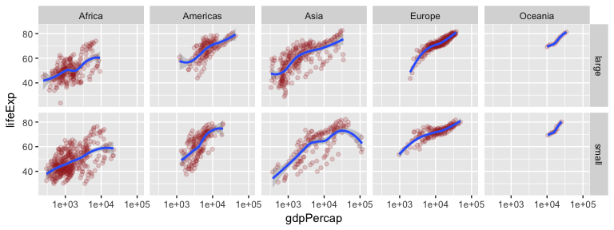

### Connect the dots with `geom_line`

Sometimes it makes sense to "connect the dots" in a scatterplot, especially if time is involved. The two functions to help us do this are:

-   `geom_line`: connect the dots from left-to-right.
-   `geom_path`: connect the dots in the order that they appear in the data frame.

With these `geom`s, it's so important to remember to specify `group=VARIABLE` in your aesthetics (`aes` function), otherwise ggplot won't distinguish between groups.

Example: life expectancy over time for each country.

``` r
## Without the `group` specification:
ggplot(gapminder, aes(year, lifeExp)) +
    geom_line()
```

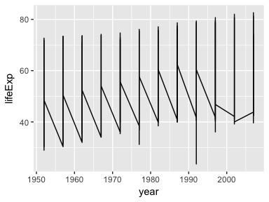

``` r
## With the group specification:
ggplot(gapminder, aes(year, lifeExp, group=country)) +
    geom_line(alpha=0.2)
```

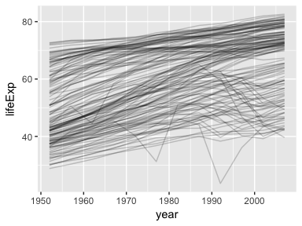

PS: such "spaghetti plots" *are* actually useful -- they give us a sense of the *distribution* of trends.

`geom_path` is typically used when a "time" variable is not shown on an axis. For example, let's look at a scatterplot of `pop` vs. `gdpPercap` of Afghanistan, and let's "connect the dots" in the order of time.

``` r
gapminder %>%
    filter(country=="Afghanistan") %>% 
    arrange(year) %>% 
    ggplot(aes(pop, gdpPercap)) +
    geom_point() +
    geom_path()
```

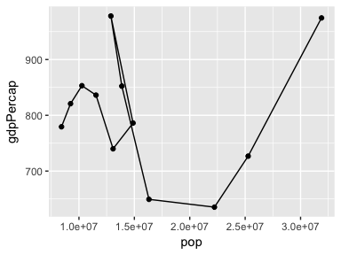

We can see the *path* that the population and GDP per capita took for Afghanistan.

**Exercise 5**: Plot the population over time (year) using lines, so that each country has its own line. Colour by `gdpPercap`. Add alpha transparency to your liking.

``` r
#gapminder %>%
#ggplot(aes(year, pop)) +
#geom_smooth(group=country, color=gapminder$gdpPercap)

#this above way of doing things does not work for me very often...

#instead shape the code like this:
ggplot(gapminder, aes(year, pop, group=country)) +
geom_line(alpha=0.25, aes(color = gdpPercap)) +
scale_color_continuous() #adding this does something idk
```

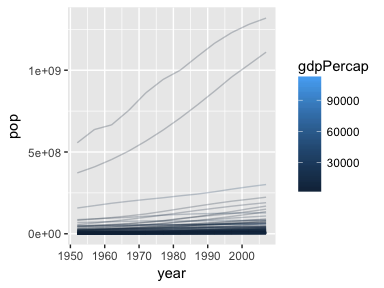

``` r
#looks kinda ugly but i did manage to code it perfectly tho!

#note to self: STOP FORGETTING THE aes() FUNCTION! IT GIVES ERRORS
```

**Exercise 6**: Add points to the plot in Exercise 5.

``` r
ggplot(gapminder, aes(year, pop, group=country)) +
geom_line(alpha=0.25, aes(color = gdpPercap)) +
geom_point()
```

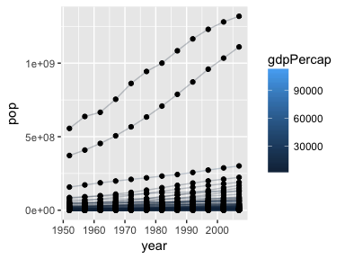

``` r
# + scale_log_10() #can't figure out why this won't work, whatever
```

Figured out the last example!
